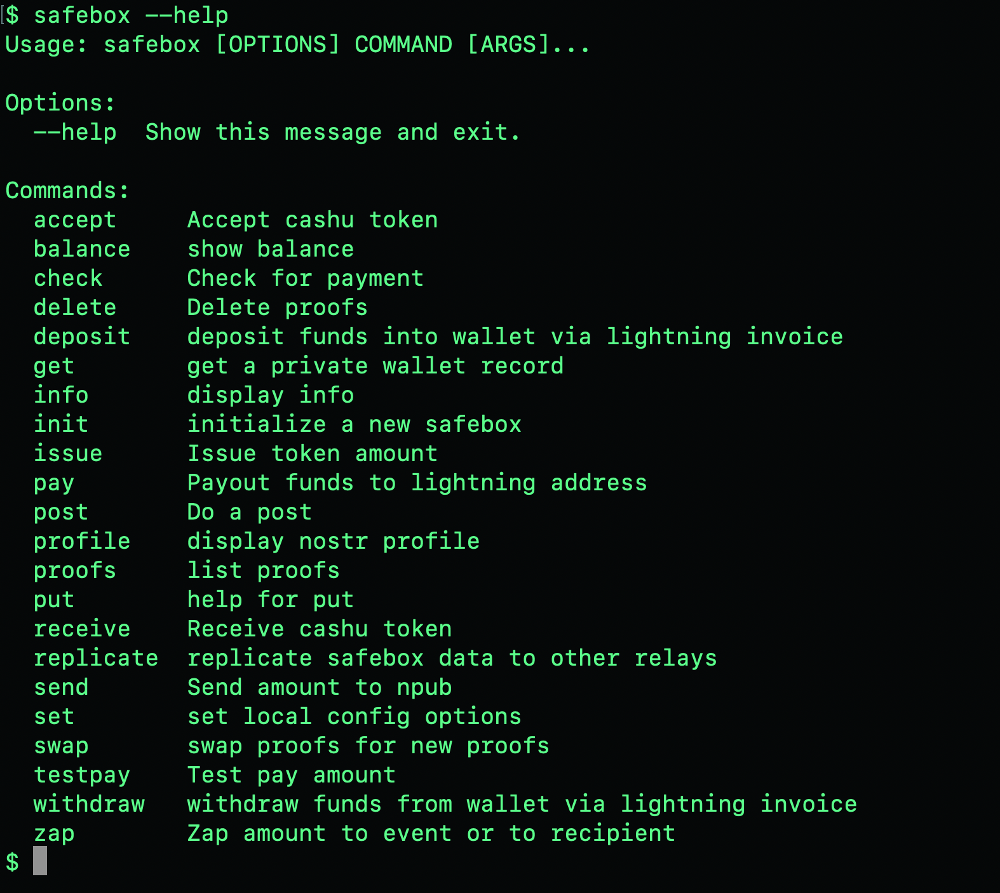

# Safebox Binaries
*Turn your machine into an ecash machine!*




## Download Mac binary
```
sudo curl -O https://raw.githubusercontent.com/trbouma/safebox-binaries/main/mac-os/safebox
sudo chmod +x ./safebox
sudo mv ./safebox /usr/bin
safebox
```

## Download Ubuntu binary
```
sudo curl -O https://raw.githubusercontent.com/trbouma/safebox-binaries/main/ubuntu/safebox
sudo chmod +x ./safebox
./safebox init
./safebox profile
./safebox balance
# sudo mv ./safebox /usr/bin

```

If all goes well, you should see the following:
```
  % Total    % Received % Xferd  Average Speed   Time    Time     Time  Current
                                 Dload  Upload   Total   Spent    Left  Speed
100 24.7M  100 24.7M    0     0  25.9M      0 --:--:-- --:--:-- --:--:-- 25.9M
Usage: safebox [OPTIONS] COMMAND [ARGS]...

Options:
  --help  Show this message and exit.

Commands:
  accept     Accept cashu token
  balance    show balance
  check      Check for payment
  delete     Delete proofs
  deposit    deposit funds into wallet via lightning invoice
  get        get a private wallet record
  info       display info
  init       initialize a new safebox
  issue      Issue token amount
  pay        Payout funds to lightning address
  post       Do a post
  profile    display nostr profile
  proofs     list proofs
  put        help for put
  receive    Receive cashu token
  replicate  replicate safebox data to other relays
  send       Send amount to npub
  set        set local config options
  swap       swap proofs for new proofs
  testpay    Test pay amount
  withdraw   withdraw funds from wallet via lightning invoice
  zap        Zap amount to event or to recipient

```
You can see help for each subcommand, for example for `./safebox deposit --help`
```
./safebox deposit --help
Usage: safebox deposit [OPTIONS] AMOUNT

  deposit funds into wallet via lightning invoice

Options:
  --help  Show this message and exit.
```
A quick note: The reason you specify `./safebox` is so the shell runs the file in the current directory. Otherwise it will try to find it in the path. If you are brave you can `sudo mv ./safebox /usr/bin` if you want to run it like an ordinary command without the annoying`./` prefix.

To see your local default configuration settings, run
```
./safebox set
```
You can change your local config for your home relay, read relays and your mint. You can add multiple read relays delimited by a comma. Don't worry about specifying `wss://` or `https://` as these are added automatically into the config file.
```
./safebox set -h strfry.openbalance.app -r relay.damus.io,nos.lol -m mint.nimo.cash
```


Create a new wallet instance with a newly-generated npub and nsec
```
./safebox init
```
There are a couple of options you can add to `./safebox init`. `-k` keeps the same nsec, `-p` publishes the profile as a `kind 0` nostr profile.

Check your profile to see if everything generated ok. You should see your npub and nsec and a few other details
```
./safebox profile
```


Getting your first funds, say for example depositing 21 sats, run
```
./safebox deposit 21
```

Scan the QR code or copy/paste the lightning invoice. Once you have paid, run

```
./safebox check invoice
./safebox balance
```
Make your first Lightning payment (Remember you need to account for fees as well)

```
./safebox pay 11 jack@primal.net -c "Hey Jack. Paying you from a nostr safebox! " 
```

Do a zap to an event (this is an event id published by Derek Ross)
```
./safebox zap 1 -e note1le5eexrydpfhnnh5k8ksrz88jgt2lkc37j2htkrq3ct02t25dzpqueaxma -c "pura vida"
```

more to come...